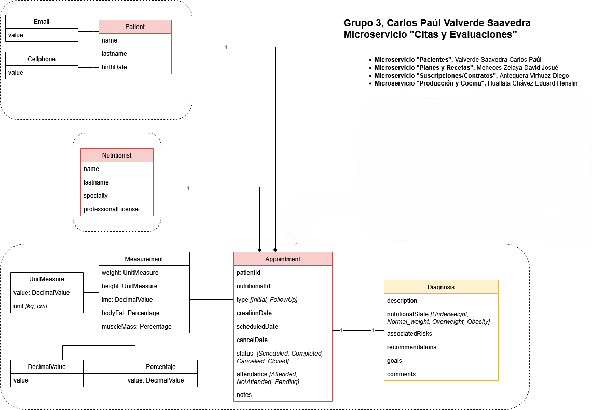

# Microservicio: Citas y Evaluaciones

## Descripción

El **Microservicio de Citas y Evaluaciones** forma parte del sistema de nurtricenter.  
Su objetivo es administrar de manera eficiente las consultas entre pacientes y nutricionistas, permitiendo el registro, control y seguimiento de cada cita.

## Funcionalidades principales

- **Gestión de nutricionistas:** listado y registro de profesionales.  
- **Programación de consultas:** permite agendar nuevas citas.  
- **Cancelación de consultas:** anulación de citas previamente registradas.  
- **Registro de inasistencias:** control de citas no atendidas por el paciente.  
- **Registro de atención:** permite documentar la atención realizada durante la consulta.